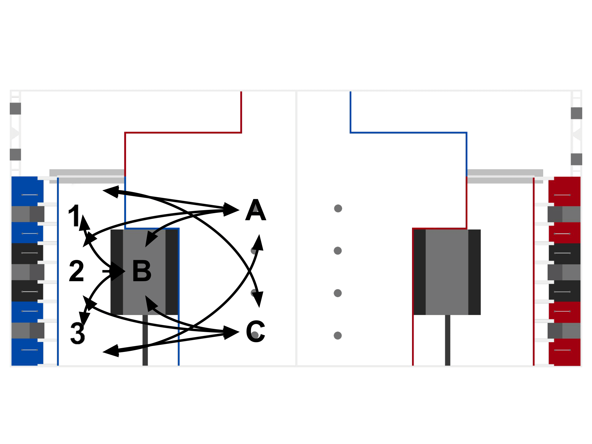

# How Autonomous Works:
**Pretzel:**

## The Pretzel Explanation

- 1, 2, 3 are starting locations 
    - 1 is to the left of the driverstation and is a cone node
    - 2 is the middle shelf or peg
    - 3 is to the right of the driver station and is a cone node
    
- A and C are pickup locations

- 4 and 5 are additional scoring locations for scoring twice during auto
  - 4 is the cube shelf to the right of 1
  - 5 is the cube shelf to the left of 3

- B is the Charge Station

## How to Use the Pretzel

- Each location is attached to an action
  - At 1, 2, 3, 4, 5 the robot scores
  - The robot will intake at A and C
  - The robot will balance at B
- In Shuffleboard we can input Auto sequences, such as:
  - **2B** - score at 2, balance
  - **3C5** - score at 3, pickup at C, score at 5
  - **2AB** - score 2, pickup at A, balance
- However, sometimes we don't want to do an action (in case of mechanical failure or other reasons). For this, we have **"!"**. For example:
  - **2B** - score at 2, balance
  - **OR !2B** - Do not score at 2, balance
  - **3!AB** - Score at 3, do not intake at A, balance

