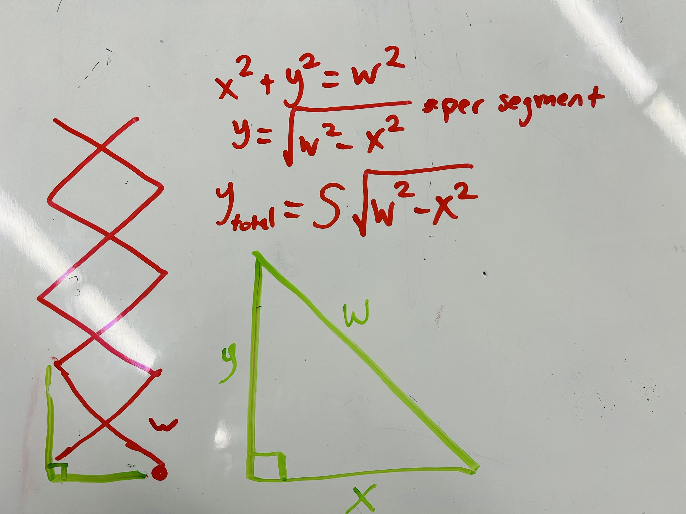
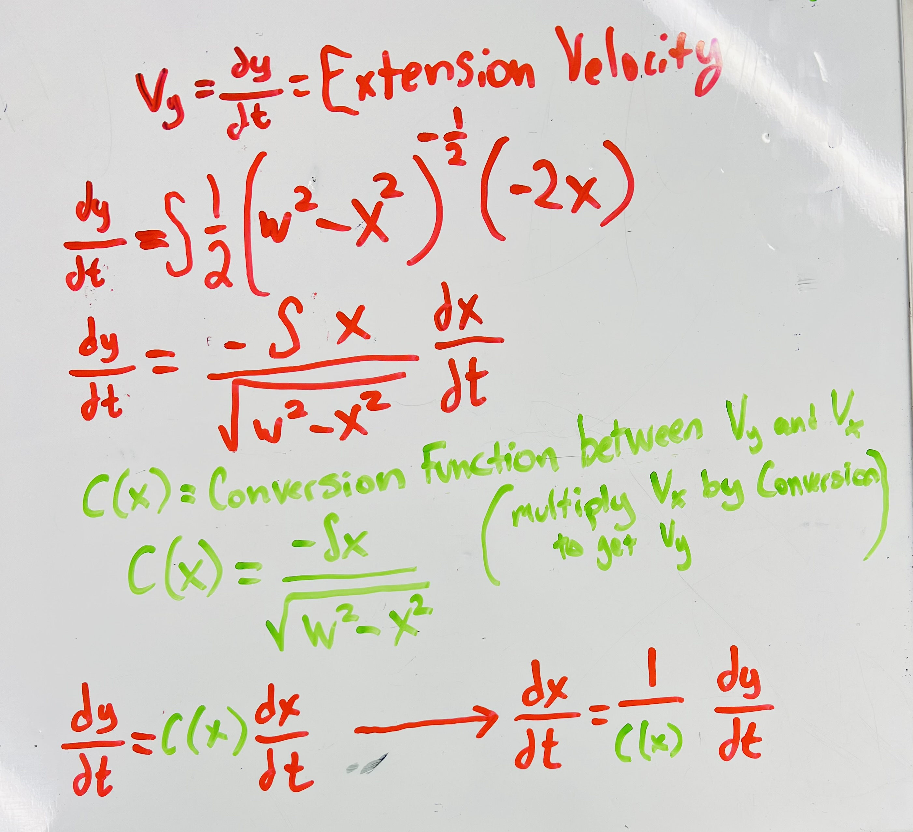

# Stinger Math

## Variables
$$
\begin{align*}
\theta &= \text{motor rotations, in rads per second} \\
N &= \text{motor input, normalised to the free speed}\\
x &= \text{lead screw distance, in meters} \\
y &= \text{stinger distance out, in meters}
\end{align*}
$$

## Constants
$$
\begin{align*}
W &= \text{length of segment, in meters} &= 0.232 \text{m} \\
S &= \text{number of segments} &= 8.5
\end{align*}
$$

## Converting From Stinger Distance to Lead Screw Distance 

Because of the fact that a single scissor segment forms two right traingles, we can use the pythagorean theorem to find the distance of the stinger from the lead screw distance and vice-versa.

$$
y = S\sqrt{W^2 - x^2} \\
\ \\
x = \sqrt{W^2 - \left(\frac{y}{S}\right)^2}
$$

We can take the derivative of this to find the velocities relative to one another.
$$
{dy \over dt} = S \cdot \frac12 (W^2-x^2)^{-\frac12}\cdot(-2x) \cdot {dx \over dt}\\
\\ \ \\ \
{dy \over dt} = -Sx \cdot (W^2-x^2)^{-\frac12} \cdot {dx \over dt}\\
\\ \ \\ \
{dy \over dt} = -{Sx \over \sqrt{W^2 - x^2}} \cdot {dx \over dt}
$$

We can extract the first term of this expression to its own function:

$$ 
C(x) = -{Sx \over \sqrt{W^2 - x^2}}
$$

Thus, our expressions become . . .

$$
{dy \over dt} = C(x) {dx \over dt}\\
\ \\
{dx \over dt} = {{dy \over dt} \over C(x)} 
$$

## Converting From Lead Screw Distance to Motor Rotation 

- x lead screw distance, (meters), theta is the rotation of motor (rads/sec)
- Converting from x to $\theta$

1 in of lead screw = 10 rot out = 400 motor rot = 800pi rads

1 in / 10 rot
1 in / 20pi rad
39.37008 in / 393.7008 rot
1 m / 31496.062992126(pi) rad
15748.031496063

$$
x (in) = \theta (rads/sec)
x (m) = \theta* \\
$$
*zero with a line / a very old greek letter / angles and numbers

$$
\theta_n = 15748.031496063 \over \\
v_f (max v speed)
$$

* 1(x) = 31496.062992126\pi \text{ rad (motor rotations, θ)} \\
